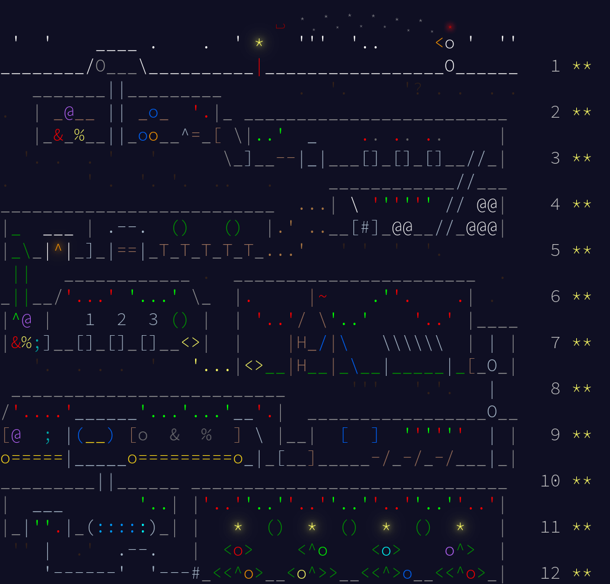

# Advent of Code

## 2025

This was my first time! I had fun learning new stuff and going down random rabbit holes. This made my holidays a little more fun, thank you [Eric Wastl](https://was.tl/)



```
You help the Elves decorate the Christmas trees with all 24 stars! 
Now, the Elves will have plenty of time to prepare for Christmas, 
and you get a well-deserved break.
```

Most of my solutions could absolutely be better, if you have any suggestions please feel free to raise an issue 

- Day 9 Part 2
- and Day 12

are especially bad

Often if I needed hints I would go checkout [@jverkamp](https://blog.jverkamp.com/2025/12/01/advent-of-code-2025/)'s solutions

To run all the solutions together simply 

```bash
❯ cd 2025/
❯ make
make[1]: Entering directory '/home/subzcuber/Downloads/acads/AoC/2025/day1'
./day1_a.out
1180
./day1_b.out
6892
make[1]: Entering directory '/home/subzcuber/Downloads/acads/AoC/2025/day2'
22062284697
46666175279
make[1]: Entering directory '/home/subzcuber/Downloads/acads/AoC/2025/day3'
17155
169685670469164
make[1]: Entering directory '/home/subzcuber/Downloads/acads/AoC/2025/day4'
./day4_a.out
9194
make[1]: Entering directory '/home/subzcuber/Downloads/acads/AoC/2025/day5'
840
359913027576322
make[1]: Entering directory '/home/subzcuber/Downloads/acads/AoC/2025/day6'
./day6_a.out
6295830249262
./day6_b.out
9194682052782
make[1]: Entering directory '/home/subzcuber/Downloads/acads/AoC/2025/day7'
./day7_a.out
1619
./day7_b.out
23607984027985
make[1]: Entering directory '/home/subzcuber/Downloads/acads/AoC/2025/day8'
./day8_a.out
72150
./day8_b.out
3926518899
make[1]: Entering directory '/home/subzcuber/Downloads/acads/AoC/2025/day9'
4745816424
1351617690
make[1]: Entering directory '/home/subzcuber/Downloads/acads/AoC/2025/day10'
449
17848
make[1]: Entering directory '/home/subzcuber/Downloads/acads/AoC/2025/day11'
./day11_a.out
603
./day11_b.out
380961604031372
make[1]: Entering directory '/home/subzcuber/Downloads/acads/AoC/2025/day12'
./day12_a.out
495
```

(i think i messed up and solved day4b in the day4a file, whoops)
