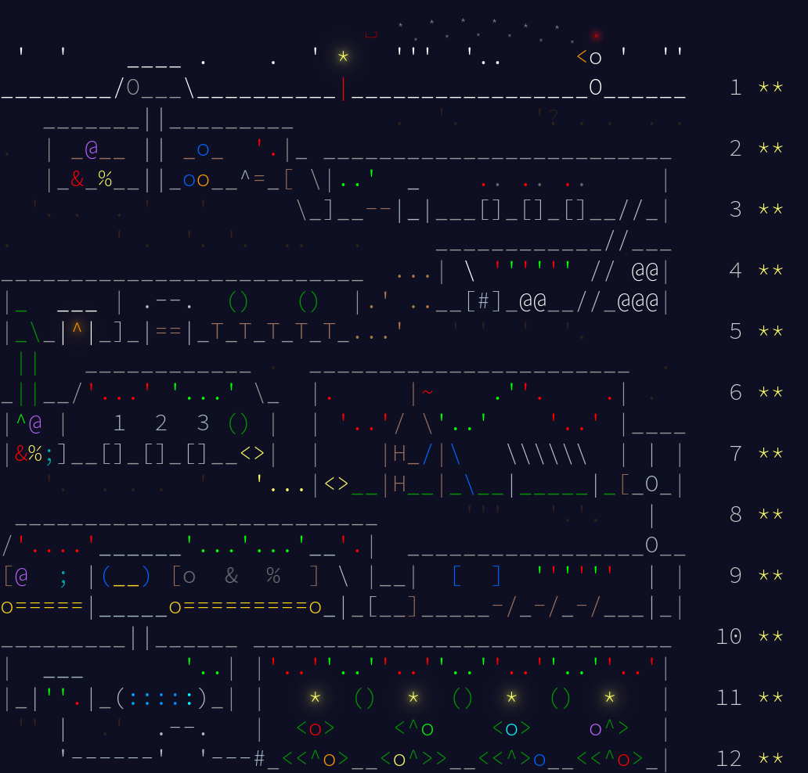

# Advent of Code

## 2025

This was my first time! I had fun learning new stuff and going down random rabbit holes. This made my holidays a little more fun, thank you [Eric Wastl](https://was.tl/)



```
You help the Elves decorate the Christmas trees with all 24 stars! 
Now, the Elves will have plenty of time to prepare for Christmas, 
and you get a well-deserved break.
```

Most of my solutions could absolutely be better, if you have any suggestions please feel free to raise an issue 

| Command | Mean [ms] | Min [ms] | Max [ms] | Relative |
|:---|---:|---:|---:|---:|
| `day01 ` | 6.8 ± 0.6 | 5.3 | 8.8 | 1.23 ± 0.16 |
| `day02 ` | 6583.3 ± 155.6 | 6321.5 | 6896.2 | 1191.63 ± 124.92 |
| `day03 ` | 68.3 ± 2.1 | 65.1 | 75.6 | 12.36 ± 1.32 |
| `day04 ` | 10.5 ± 0.7 | 8.8 | 12.2 | 1.90 ± 0.23 |
| `day05 ` | 63.2 ± 2.3 | 58.4 | 70.6 | 11.44 ± 1.24 |
| `day06 ` | 7.1 ± 0.6 | 5.5 | 8.6 | 1.28 ± 0.17 |
| `day07 ` | 6.9 ± 0.6 | 5.2 | 9.0 | 1.24 ± 0.17 |
| `day08 ` | 686.0 ± 35.7 | 633.6 | 753.4 | 124.17 ± 14.23 |
| `day09 ` | 15.1 ± 0.8 | 13.2 | 18.1 | 2.74 ± 0.31 |
| `day10 ` | 1238.5 ± 29.3 | 1195.7 | 1307.4 | 224.18 ± 23.50 |
| `day11 ` | 9.0 ± 0.9 | 6.7 | 12.0 | 1.62 ± 0.23 |
| `day12 ` | 5.5 ± 0.6 | 4.3 | 7.2 | 1.00 |


- Day 2 Part B
- Day 8 Part B
- and Day 12 (fast but technically wrong)

are especially bad

Often if I needed hints I would go checkout [@jverkamp](https://blog.jverkamp.com/2025/12/01/advent-of-code-2025/)'s solutions

To run all the solutions together simply 

```bash
❯ cd 2025/
❯ make all
❯ make run
=== day01/ ===
1180
6892
=== day02/ ===
22062284697
46666175279
=== day03/ ===
17155
169685670469164
=== day04/ ===
1493
9194
=== day05/ ===
840
359913027576322
=== day06/ ===
6295830249262
9194682052782
=== day07/ ===
1619
23607984027985
=== day08/ ===
72150
3926518899
=== day09/ ===
4745816424
1351617690
=== day10/ ===
449
17848
=== day11/ ===
603
380961604031372
=== day12/ ===
495
```
